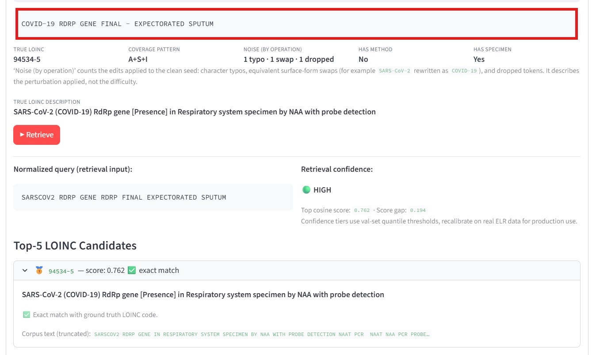

# LOINC Crosswalk: mapping messy lab test names to standard codes

[](https://loinc-codes-crosswalk-pl.streamlit.app)
[](https://www.python.org/)


**[▶ Live demo](https://loinc-codes-crosswalk-pl.streamlit.app) · [Methodology](#how-it-works) · [Notebooks](notebooks/)**

A clinical NLP retrieval system that maps noisy, free-text lab test names from
electronic lab reports to standardized **LOINC** codes, framed as an information
retrieval (entity resolution) problem.

> **Try it in 10 seconds:** the [interactive Streamlit app](https://loinc-codes-crosswalk-pl.streamlit.app)
> lets you type a messy lab string, watch the candidate LOINC codes ranked in
> real time, and explore the ablations and error analysis. No setup required.


<a href="streamlit_screenshot.jpg" target="_blank">
  
</a> 


## 📌 TL;DR

When a lab reports a result, the test name often arrives as a messy, inconsistent
string (eg. `SARS COVID-19 PCR Nasophar`). Downstream systems need it mapped to one
standard code. I built and benchmarked a retrieval system that does this mapping
automatically.

- **Headline result:** the best model retrieves the correct code with a
  **grouped MRR of 0.747**, matching each query against the full **98-code**
  COVID-19 surveillance corpus, on a held-out set of **5,280** simulated lab
  strings.
- **The interesting finding:** a simple **TF-IDF** model beat every neural
  sentence transformer I tested, by **0.13 in grouped MRR** overall. The data
  explains why, and I show it below.
- **Why it travels beyond healthcare:** this is a self-contained study in
  matching the model to the structure of the data, rather than reaching for the
  largest embedding model by default.

---

## 🩺 Why this problem matters

LOINC crosswalking is a persistent challenge in health data interoperability.
Electronic laboratory results often arrive with inconsistent naming conventions
across vendors, instruments, and laboratory information systems. Accurate mapping
is required for:

- Public health reporting
- Health information exchange (HIE)
- Clinical analytics
- Longitudinal patient records
- Multi-site research studies

This project investigates how retrieval-based approaches perform under realistic
laboratory naming variation, and quantifies the value of domain-specific
vocabulary engineering relative to modern embedding models.

> **Three terms, up front:** *LOINC* is the universal code system for lab tests
> (a barcode for "SARS-CoV-2 RNA by PCR"). An *ELR* is the electronic message a
> lab sends to a public health agency. *LIVD* is a public CDC table linking real
> FDA-authorized test kits to their LOINC codes, which is what makes realistic
> simulation possible.

---

## 🔁 The same problem in ML terms

Although this project is rooted in healthcare interoperability, the underlying
problem is familiar to many machine learning domains.

| Healthcare concept | ML equivalent |
|---|---|
| LOINC mapping | Entity resolution |
| ELR test name | Noisy query |
| LOINC reference table | Candidate document corpus |
| Crosswalk | Retrieval and ranking |
| Vendor naming variation | Domain shift |
| Abbreviations and aliases | Vocabulary mismatch |
| Missing specimen or method fields | Feature omission |

The objective is to retrieve the correct standardized laboratory concept from a
fixed candidate set despite noisy, incomplete, and highly variable input strings.

> **Scope:** the retrieval corpus is the full **98-code** CDC COVID-19 surveillance
> panel. After deduplication and a minimum-seed filter, **36** of those codes
> appear in the simulated ELR data, so every query is matched against all 98 while
> evaluation runs on the 36 that occur in practice. The other 62 act as a
> realistic in-corpus haystack.

---

## 📊 Results

All evaluation uses **specimen-aware grouped MRR** on a held-out validation set
of **5,280** simulated ELR strings (the validation slice of 6,600 total; the rest
are the test split). Queries are retrieved against the full 98-code surveillance
corpus. MRR rewards ranking the right answer near the top; "grouped" credits
clinically equivalent codes (see the collapsible under [How it works](#how-it-works)).

| Configuration | Grouped MRR |
|---|---|
| **TF-IDF (`lcn_method_dict_combined`, word unigram, 0 distractors)** | **0.747** |
| TF-IDF, brand filter (production-feasible) | 0.748 |
| TF-IDF, oracle filter (perfect-metadata upper bound) | 0.767 |
| Best sentence transformer (S-PubMedBERT-MS-MARCO) | 0.617 |

**TF-IDF wins, and that is the point.** The lexical model leads the best dense
encoder by **0.13 in grouped MRR**. The reason is in the data: vocabulary overlap
between the ELR query space and the LOINC corpus is only **7.8%**, so the task
rewards exact-token matching over semantic similarity. The gap is widest on
**analyte-only queries** (coverage pattern `A`: TF-IDF **0.737** vs ST **0.524**,
a gap of **0.21**), where a dense encoder has no method or specimen signal to lean
on and the lexical model still matches the analyte name directly.

The oracle ceiling of 0.767 confirms the remaining headroom is genuine retrieval
ambiguity, not something more metadata filtering could recover. The brand filter
adds almost nothing (0.747 to 0.748) because the corpus is already skewed toward
probe-amplification assays, so method imputation has little to disambiguate.

<details>
<summary><b>Noise robustness (per noise level)</b></summary>

| Noise level | TF-IDF | Best ST |
|---|---|---|
| Low | 0.762 | 0.634 |
| Medium | 0.710 | 0.570 |
| High | 0.510 | 0.457 |

TF-IDF stays ahead at every level. From low to high noise it loses **0.25 in
grouped MRR** versus **0.18** for the best sentence transformer. Compression noise
(a token swapped for an equivalent surface form) is largely recovered by the
retrieval-side expansion dictionaries; omission noise (signal deleted entirely)
hurts both models.

Note that omission count correlates with method-token absence (Pearson
r = -0.73), because structural template omission and target deletion both
increment the omission counter and both reduce method signal. Omission-stratified
results should therefore be read alongside coverage patterns rather than as a pure
noise effect.
</details>

<details>
<summary><b>Why I shipped the simpler model (selection rationale)</b></summary>

A more complex configuration (`component_weighted_method_dict`, mixed word and
character model, alpha = 0.3, 143 distractors) reached **0.760**. I selected the
simpler `lcn_method_dict_combined` word-unigram model (**0.747**) anyway, for
three reasons:

1. **Parsimony.** The **0.013 grouped-MRR gap** does not justify a mixed
   vectorizer plus external distractor sampling.
2. **Robustness to corpus changes.** Zero distractors means the corpus is fixed
   at deployment, which is easier to reason about in production.
3. **Distractor effect is unstable.** The complex config improves with distractors (this effect depends on the choice of alpha) while the simpler one degrades monotonically, so the distractor benefit may not
   generalize beyond this corpus.

All downstream analyses (filters, error analysis, noise) use the simpler configuration.
</details>

---

<a id="how-it-works"></a>

## ⚙️ How it works

```
CDC LIVD Table ─► Preprocessing ─► Clean seeds (551 rows, 36 LOINC codes)
                                          │
                                   ELR simulation
                              (~12 variants/seed → 6,600 strings)
                                          │
                          ┌───────────────┴───────────────┐
                     TF-IDF retrieval            Sentence transformers
              (98-code corpus, strategy ablation) (6 models × 2 strategies)
                          │                                             |
                  Post-retrieval filters (oracle / brand imputation)    |
                          │                                             |  
                  Specimen-aware grouped MRR evaluation ────────────────┘
```

In short: real CDC device submissions are turned into realistic noisy lab strings,
those strings are matched against a 98-code LOINC corpus by cosine similarity,
optional metadata filters rerank the candidates, and everything is scored with a
clinically aware MRR. The details are provided in depth below.

<details>
<summary><b>Data sources</b></summary>

**CDC LIVD table.** FDA-authorized SARS-CoV-2 test-kit submissions mapping devices
to LOINC codes via vendor analyte names, specimen descriptions, and methods. It
defines the scope for this project - any LOINC code it references is in the corpus, covering single-analyte COVID codes and combination respiratory panels (flu A/B, RSV, SARS-CoV-2).

**LOINC table.** This is inner joined to LIVD on LOINC code, providing component, system, method,
scale, and long common name for corpus construction.

Raw files are not committed. LIVD:
[CDC SARS-CoV-2 LIVD page](https://www.cdc.gov/csels/dls/livd-codes.html). LOINC:
[loinc.org](https://loinc.org/downloads/) (free registration).
</details>

<details>
<summary><b>Simulation design (deduplication, noise taxonomy, query templates)</b></summary>

**Deduplication.** The raw merged LIVD table holds roughly 998 device rows. Rows
listing multiple valid specimens (stored newline-separated) are exploded to one
row per specimen, giving 1,829 rows across 36 codes, because specimen type is a
simulation axis and collapsing it would suppress naming variation. These are then
deduplicated on a clinical key (component, method, system, vendor analyte name),
removing manufacturer redundancy while keeping genuine cross-vendor naming
differences producing 642 rows. A minimum-seeds filter (at least 3 LIVD rows per code)
yields **551 clean seeds**, expanded to **6,600 ELR strings** (roughly 12 variants
per seed), split into 5,280 validation rows and 1,320 test rows. All reported numbers are on the
validation split.

**Noise taxonomy.** Three independently tracked dimensions were considered, defined on the input
string rather than on any model's reaction to it:

- *Corruption*: character-level typos (swap, skip, extra), token identity partly
  destroyed. Spaces excluded, since space insertion is not a realistic keystroke
  error in structured fields.
- *Compression*: a signal token replaced by an equivalent surface form
  (`SARS-CoV-2` to `COVID-19`, `RNA` to `PCR`, `nucleocapsid` to `N-GENE`).
  Information is present but re-encoded, recoverable by a domain-aware model.
- *Omission*: signal deleted entirely (empty replacement, or a whole component
  structurally absent). Unrecoverable without external metadata or a
  retrieval-side expansion dictionary.

Interpretation tokens (`STATUS`, `RESULT`, `FINAL`) are appended at 10% probability
to mimic LIS verbosity but are not counted as noise, since they do not damage
signal and carry near-zero IDF.

**Templates.** Strings are assembled from up to four components (model, analyte,
method, specimen) under six weighted templates representing an assumed prior over
field completeness. The dominant templates are analyte+method+specimen (30%) and
analyte+method (30%), reflecting how often older LIS systems drop the specimen
segment.

**Coverage patterns.** Each string is scored for which signals are present:
A (analyte), M (method), S (specimen), I (interpretation). Most common: `A+M`
(41%), `A+M+S` (22%), `A` alone (12%).
</details>

<details>
<summary><b>Corpus strategies (the ablation)</b></summary>

The corpus is always the same 98 LOINC code surveillance panel; only the text
representation of each code varies, created by combining different columns of the LOINC table.

- **`lcn_only`** (baseline): long common name only.
- **`combined`**: long common name (repeated twice) + system expansion +
  relatednames2. The repetition counteracts dilution from the long, heterogeneous
  relatednames2 field, which inflates raw term frequencies and lowers the relative
  weight of discriminative long-common-name tokens.
- **`lcn_method_dict_combined`** *(overall best)*: long common name + system
  expansion + method dictionary expansion, no repetition. Replaces generic LOINC
  system and method values with domain surface forms (`Nph` to
  `"Nasopharynx Nasopharyngeal NP NPH"`, `Probe.amp.tar` to
  `"NAAT NAA PCR RT-PCR QPCR"`). It beats `combined` without repetition, which
  means a compact method dictionary removes the dilution problem at its source
  rather than compensating for it.
- **`lcn_method_dict_filtered_rn`**: as above plus relatednames2 filtered to drop
  tokens appearing in more than 85% of codes. Underperforms, so residual
  relatednames2 content adds noise even after filtering.
- **`component_weighted_method_dict`**: component (repeated twice) + method
  dictionary + system expansion. Strong with distractors but unstable as
  distractor count grows.

Higher repetition counts (3x and combinations) were tested and removed; all
performed below their lower-repetition counterparts, confirming that string
repetition is an unreliable substitute for explicit vocabulary expansion.
</details>

<details>
<summary><b>Post-retrieval filters and the evaluation metric</b></summary>

**Oracle filter (upper bound).** Uses ground-truth method class (NAAT vs antigen)
and specimen from the simulated row to demote mismatches (0.5x penalty), then
re-ranks. An unrealistic but useful ceiling on what perfect metadata extraction
could buy.

**Brand filter (production-feasible).** Scans the ELR string for instrument brand
tokens (`COBAS`, `VERITOR`, `XPERT`) and imputes method class via a curated lookup
(`COBAS` to `probe.amp.tar`), applying the same demotion. Feasible because it needs
only the string itself. Its effect is near zero (0.747 to 0.748), and it is
byte-identical to no filter across almost every coverage pattern, confirming the
corpus is already method skewed.

**Primary metric: specimen-aware grouped MRR.** For each string, the valid answer
set is expanded beyond the single true code to include codes sharing component and
method with a specimen compatible system, plus gene target ambiguous codes that
vendor analyte names cannot distinguish. This handles LOINC's use of generic
respiratory specimen codes for COVID reporting: 45.5% of wrong top 1 predictions
are specimen specificity mismatches (for example Nose vs Respiratory System)
absorbed by the grouped metric rather than true retrieval failures.

**Splits.** The simulated data is randomly split into validation (80%) and test (20%) sets, stratified by LOINC codes to ensure the same distribution of codes occurs in both splits.
</details>

---

## 🗂️ Repository structure

```
loinc-crosswalk/
├── src/
│   ├── clinical_utils.py                 # Domain constants, text cleaning, specimen normalization
│   ├── model_building_utils.py           # Corpus construction, TF-IDF index, retrieval, evaluation
│   ├── ablation.py                       # Ablation runners: primary, secondary, filter
│   ├── elr_simulation.py                 # ELR simulation pipeline
│   ├── sentence_transformer_ablation.py   # ST model benchmarking
│   ├── error_analysis.py                  # Error classification and visualization
│   ├── corpus_and_simulation_viz.py       # UMAP, similarity, simulation visuals
│   ├── livd_and_loinc_preprocessing.py    # Raw data loading, merging, filtering
│   └── __init__.py
├── notebooks/
│   ├── ablation_results_combined.ipynb
│   ├── corpus_simulation_viz.ipynb
│   ├── error_analysis.ipynb
│   └── test_set_evaluation.ipynb
├── streamlit_app.py                          # Streamlit portfolio dashboard
├── requirements.txt
├── .gitignore
└── README.md
```

---

## 🚀 Setup and reproduction

```bash
git clone https://github.com/<your-username>/loinc-crosswalk.git
cd loinc-crosswalk
python -m venv venv
source venv/bin/activate        # Windows: venv\Scripts\activate
pip install -r requirements.txt
```

Place the LIVD and LOINC source files in `data/raw/` per the paths in
`src/livd_and_loinc_preprocessing.py`, then run in order:

```bash
python src/livd_and_loinc_preprocessing.py   # produces data/processed/
python src/elr_simulation.py                 # produces elr_simulated.csv
python src/ablation.py                        # primary and filter ablation CSVs
python src/sentence_transformer_ablation.py   # ST ablation CSV
```

Before launching the app, run the test-set evaluation notebook exactly once:

```bash
jupyter execute notebooks/test_set_evaluation.ipynb
```

This produces the summary tables the Streamlit app loads. It should be run only
once: it evaluates the held-out test split, and re-running it after inspecting
results would compromise the integrity of the test-set evaluation.

```bash
streamlit run app/app.py
```

The remaining analysis notebooks (`ablation_results_combined`, `corpus_simulation_viz`,
`error_analysis`) can run in any order and do not affect the app.

---

## ⚠️ Limitations

- **Simulation-based.** Generalization is over perturbations of known LOINC codes,
  not over genuinely novel submissions from unseen senders. Validation against real
  de-identified ELR data is planned.
- **LIVD-bounded scope.** 98-code surveillance corpus, 36 codes with ELR data,
  covering COVID and combination respiratory panels. Influenza-only, RSV-only, and
  strep are out of scope; the full respiratory space is the natural extension.
- **Specimen filtering is weak by design.** The dominant system value is the
  generic `Respiratory System Specimen` catch-all, so method signal carries far
  more discriminative weight than specimen. This is a domain finding, not a bug.
- **Template weights are assumed priors.** No ground-truth field-completeness
  distribution was available; CDC NNDSS or state ELR intake logs could supply one.

---

## 🔭 Future work

- Validate against real de-identified ELR submissions (PhysioNet / MIMIC-IV access
  in progress; CITI certification complete).
- Extend to non-COVID respiratory LOINC codes.
- Fine-tune a domain sentence transformer on clinical text.

---

## 📄 Acknowledgements & data licensing

This material contains content from LOINC (http://loinc.org). LOINC is copyright
© Regenstrief Institute, Inc. and the Logical Observation Identifiers Names and
Codes (LOINC) Committee and is available at no cost under the license at
http://loinc.org/license. LOINC® is a registered United States trademark of
Regenstrief Institute, Inc.

The LOINC content redistributed in this repository is limited to a subset of the
COVID-19 surveillance terms, restricted to the fields the application requires,
with every record retaining its LOINC code (`loinc_num`) and long common name
(`long_common_name`) in accordance with Section 10 of the LOINC license. The full
notice is also provided in [`LOINC_short_license.txt`](LOINC_short_license.txt).
LOINC version used: <2.81>.

The CDC LIVD device submission table is a public-domain CDC resource. This project
is not affiliated with or endorsed by the Regenstrief Institute or the CDC.